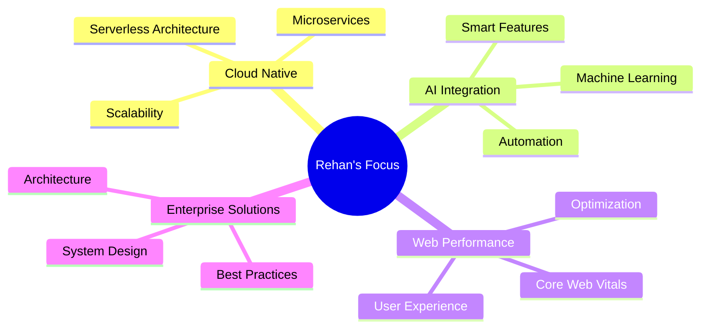

# 👋 Hey there! I'm Rehan Ali

<div align="center">
  


</div>

<p align="center">
  
  
</p>

---

## 🚀 About Me

```typescript
const rehan = {
    title: "Senior Full Stack Developer",
    location: "Pakistan 🇵🇰",
    focus: ["Web Development", "Enterprise Solutions", "UI/UX Design"],
    currentlyLearning: ["Cloud Architecture", "AI Integration", "Web3"],
    funFact: "I turn coffee ☕ into scalable applications ⚡",
    motto: "Clean code is not written by following a set of rules. 
           You don't become a software craftsman by learning a list of heuristics."
};
```

## 🛠️ Tech Arsenal

<div align="center">

### 💻 Frontend Mastery


### ⚙️ Backend Excellence


### ☁️ Cloud & DevOps


</div>

## 📊 GitHub Analytics

<div align="center">
  
  
</div>

<div align="center">
  
</div>

## 🏆 Featured Projects

<div align="center">

### 💎 LuxeFleurs E-commerce Platform
[](https://luxefluers.netlify.app)

*Full-stack e-commerce solution with Stripe integration, Firebase backend, and 95+ Lighthouse scores*

**Tech Stack:** `React` `Firebase` `Stripe API` `Real-time Updates`

---

### 📝 Pen & Pixel CMS
[](https://penandpixel.netlify.app)

*Enterprise content management system with rich text editing and multi-user collaboration*

**Tech Stack:** `MERN Stack` `JWT Auth` `Cloud Storage` `Real-time Collaboration`

---

### 🏢 FA Consultants Corporate Site
[](https://faconsultants.co/)

*Professional corporate platform with advanced animations and sub-2 second load times*

**Tech Stack:** `React SPA` `Performance Optimization` `Custom Animations`

</div>

## 🎯 Current Focus

<div align="center">



</div>

## 💼 Professional Highlights

<div align="center">

| 🎯 **Specialty** | 🚀 **Achievement** |
|:---|:---|
| **Enterprise Applications** | Built scalable systems handling thousands of concurrent users |
| **E-commerce Solutions** | Integrated payment gateways processing $100K+ transactions |
| **Performance Optimization** | Achieved 95+ Lighthouse scores across all metrics |
| **Team Leadership** | Led cross-functional teams in agile development environments |
| **Client Satisfaction** | Delivered 15+ successful projects with 100% client satisfaction |

</div>

## 🌐 Connect With Me

<div align="center">

[](https://rehaanali.netlify.app)
[](mailto:rehaann.dev@gmail.com)
[](https://www.linkedin.com/in/rehan-ali-7780752b3)

</div>

---

<div align="center">

### 🎨 "Code is like humor. When you have to explain it, it's bad." - Cory House

**💡 Open to:** Full-time opportunities • Consulting engagements • Collaborative projects

**🔥 Specializing in:** Enterprise web applications • E-commerce platforms • Performance-critical systems

---


---

⭐ **If my work inspires you, consider giving my repositories a star!** ⭐

*Building the future, one commit at a time* 🚀

</div>
