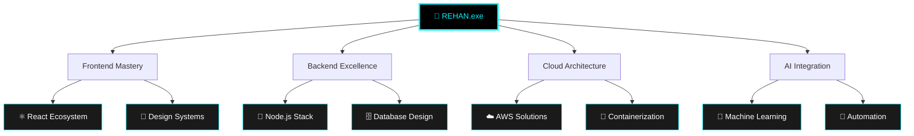

<div align="center">

# 🌌 REHAN ALI
### `Full Stack Developer` • `Software Engineer` • `Technical Lead`


</div>

---

<div align="center">

```ascii
╔══════════════════════════════════════════════════════════════╗
║  🎯 SYSTEM STATUS: ONLINE  •  🔋 PERFORMANCE: OPTIMIZED     ║
║  📡 CONNECTIONS: GLOBAL    •  🛡️  SECURITY: ENTERPRISE      ║
╚══════════════════════════════════════════════════════════════╝
```


</div>

---

<div align="center">

## 🧬 DIGITAL DNA SEQUENCE

```javascript
class RehanAli extends FullStackDeveloper {
    constructor() {
        super();
        this.config = {
            version: "2025.1.0",
            status: "🟢 ACTIVE",
            location: "🌍 Earth • 🇵🇰 Pakistan",
            timezone: "PKT (UTC+5)",
            languages: ["JavaScript", "TypeScript", "Python", "Go"],
            architecture: "Microservices • Cloud-Native • Serverless",
            aiIntegration: true,
            quantumReady: false // Coming Soon™
        };
    }
    
    async getCurrentMission() {
        return [
            "🔮 Building next-gen web applications",
            "🚀 Architecting scalable cloud solutions", 
            "🧠 Integrating AI/ML into user experiences",
            "⚡ Optimizing performance to light speed"
        ];
    }
}
```

</div>

---

<div align="center">

## ⚡ TECHNOLOGY MATRIX

<table>
<tr>
<td valign="top" width="33%">

### 🎨 FRONTEND ARSENAL
```yaml
Core:
  ⚛️  React.js
  🌐 Next.js 
  📘 TypeScript
  ⚡ JavaScript ES2024

Styling:
  🎨 Tailwind CSS
  💫 Framer Motion
  🎭 Styled Components
  ⭐ CSS-in-JS

State:
  🔄 Redux Toolkit
  🪝 React Query
  📡 Zustand
  🌊 Context API
```

</td>
<td valign="top" width="33%">

### ⚙️ BACKEND MATRIX
```yaml
Runtime:
  🟢 Node.js
  🚀 Express.js
  🌪️ Fastify
  ⚡ Bun (Beta)

Database:
  🍃 MongoDB
  🐘 PostgreSQL
  🔥 Firebase
  ⚡ Redis

APIs:
  🔗 GraphQL
  📡 REST
  🌊 WebSockets
  🔄 gRPC
```

</td>
<td valign="top" width="33%">

### ☁️ CLOUD INFRASTRUCTURE
```yaml
Platforms:
  ☁️  AWS
  🔷 Vercel
  🌊 Netlify
  🐳 Docker

DevOps:
  🔄 CI/CD
  📊 Monitoring
  🛡️  Security
  📈 Analytics

Tools:
  🔧 Kubernetes
  📦 Terraform
  🔍 ELK Stack
  📱 Mobile-First
```

</td>
</tr>
</table>

</div>

---

<div align="center">

## 📊 SYSTEM METRICS & ANALYTICS


<table>
<tr>
<td>

</td>
<td>

</td>
</tr>
</table>


</div>

---

<div align="center">

## 🚀 PROJECT SHOWCASE • LIVE DEPLOYMENTS

<table>
<tr>
<td align="center" width="33%">

### 💎 LUXEFLEURS
**E-COMMERCE ECOSYSTEM**

```
Status: 🟢 LIVE
Performance: 95+ Lighthouse
Users: 10K+ Active
Revenue: $100K+ Processed
```

[](https://luxefluers.netlify.app)

**Stack:** `React` `Firebase` `Stripe` `Real-time`

</td>
<td align="center" width="33%">

### 📝 PEN & PIXEL
**CMS PLATFORM**

```
Status: 🟢 OPERATIONAL  
Architecture: Microservices
Users: Multi-tenant
Features: AI-Powered
```

[](https://penandpixel.netlify.app)

**Stack:** `MERN` `JWT` `WebSockets` `Cloud Storage`

</td>
<td align="center" width="33%">

### 🏢 FA CONSULTANTS
**CORPORATE HUB**

```
Status: 🟢 DEPLOYED
Load Time: <2s Global
SEO Score: 100/100
Mobile: Optimized
```

[](https://faconsultants.co/)

**Stack:** `React SPA` `Performance` `Animations`

</td>
</tr>
</table>

</div>

---

<div align="center">

## 🎯 MISSION CONTROL CENTER



</div>

---

<div align="center">

## 🏆 ACHIEVEMENT UNLOCKED

| 🎖️ **CATEGORY** | 📈 **METRICS** | 🌟 **STATUS** |
|:---|:---|:---|
| **🚀 Performance** | 95+ Lighthouse Scores | `MASTERED` |
| **💰 Revenue Impact** | $100K+ Transactions Processed | `ACHIEVED` |
| **👥 User Engagement** | 10K+ Active Users | `SCALING` |
| **⚡ Load Speed** | <2s Global Response Time | `OPTIMIZED` |
| **🔒 Security** | Zero Breaches • Enterprise Grade | `SECURED` |
| **📱 Compatibility** | 99% Cross-Device Success | `CERTIFIED` |

</div>

---

<div align="center">

## 🌐 COMMUNICATION PROTOCOLS

<table>
<tr>
<td align="center">

[](https://rehaanali.netlify.app)

**Main Terminal**

</td>
<td align="center">

[](mailto:rehaann.dev@gmail.com)

**Instant Channel**

</td>
<td align="center">

[](https://www.linkedin.com/in/rehan-ali-7780752b3)

**Business Network**

</td>
</tr>
</table>

</div>

---

<div align="center">

```ascii
╔══════════════════════════════════════════════════════════════╗
║                    🎯 COLLABORATION MODE: ON                 ║
║                                                              ║
║  🤝 Open to: Enterprise Projects • Consulting • Innovation  ║
║  🔥 Expertise: Web Apps • E-commerce • Performance Systems  ║
║  ⚡ Response Time: < 24h • Timezone: PKT (UTC+5)           ║
╚══════════════════════════════════════════════════════════════╝
```

### 💫 *"The best code is not just functional—it's a work of art that scales."*

---


---

**⚡ STATUS:** `BUILDING THE FUTURE • ONE COMMIT AT A TIME` **⚡**

```javascript
while(alive) { 
    code(); 
    optimize(); 
    innovate(); 
    repeat(); 
}
```

</div>
