<div align="center">

<!-- ANIMATED HEADER -->


</div>

<div align="center">

<!-- DYNAMIC TYPING WITH JS FOCUS -->


</div>

<!-- SYSTEM STATUS BAR -->
<div align="center">

```console
╭─────────────────────────────────────────────────────────────────╮
│ 🟢 SYSTEM: ONLINE    │ ⚡ JS ENGINE: V8 TURBO   │ 🔥 HOT: RELOAD │
│ 📊 UPTIME: 99.99%     │ 🚀 BUILD: PRODUCTION     │ 🎯 READY: TRUE │
╰─────────────────────────────────────────────────────────────────╯
```


</div>

---

<div>

## 🧬 DEVELOPER.CONFIG

```typescript
interface Developer {
  name: string;
  role: string[];
  location: GeoLocation;
  languages: ProgrammingLanguage[];
  expertise: TechStack[];
  currentFocus: string[];
  architecture: DesignPattern[];
}

const rehan: Developer = {
  name: "Rehan Ali",
  role: ["Full Stack Developer", "JavaScript Architect", "Performance Engineer"],
  location: { country: "🇵🇰", timezone: "PKT+5", remote: true },
  languages: ["JavaScript", "TypeScript", "JSX", "TSX", "Python", "Go"],
  expertise: ["React.js", "Next.js", "Node.js", "Express", "MongoDB", "AWS"],
  currentFocus: [
    "🔮 Advanced React Patterns",
    "⚡ Web Performance Optimization", 
    "🤖 AI-Driven Development",
    "🌊 Serverless Architecture"
  ],
  architecture: ["MVC", "JAMstack", "Microservices", "Event-Driven"]
} as const;

// Runtime Status
console.log(`🚀 ${rehan.name} is currently: ${rehan.currentFocus.join(" • ")}`);
```

</div>

---

<div align="center">

## ⚡ JAVASCRIPT ECOSYSTEM MASTERY

<!-- Tech Stack with smooth animations -->
<table>
<tr>
<td valign="top" width="50%">

### 🎯 FRONTEND POWERHOUSE
```jsx
// React Excellence
const Frontend = () => {
  const [skills] = useState([
    { tech: "React.js", level: "Expert", years: 5 },
    { tech: "Next.js", level: "Advanced", focus: "SSR/SSG" },
    { tech: "TypeScript", level: "Proficient", usage: "Daily" },
    { tech: "Redux Toolkit", level: "Expert", pattern: "RTK Query" },
    { tech: "Tailwind CSS", level: "Master", approach: "Utility-first" },
    { tech: "Framer Motion", level: "Advanced", specialty: "Animations" }
  ]);

  return (
    <div className="tech-stack">
      {skills.map(skill => (
        <TechBadge key={skill.tech} {...skill} />
      ))}
    </div>
  );
};
```

</td>
<td valign="top" width="50%">

### ⚙️ BACKEND ARCHITECTURE  
```javascript
// Node.js Ecosystem
class BackendMaster {
  constructor() {
    this.runtime = "Node.js";
    this.frameworks = ["Express.js", "Fastify", "NestJS"];
    this.databases = ["MongoDB", "PostgreSQL", "Redis"];
    this.auth = ["JWT", "OAuth", "Passport.js"];
    this.apis = ["REST", "GraphQL", "WebSockets"];
  }

  async buildAPI(requirements) {
    const server = new Express();
    server.use(middleware.performance());
    server.use(middleware.security());
    return server.optimize();
  }
}

const backend = new BackendMaster();
```

</td>
</tr>
</table>

</div>

---

<!-- GITHUB STATS DASHBOARD -->
<div align="center">

## 📊 PERFORMANCE ANALYTICS DASHBOARD


<!-- Main Stats Grid -->
<table>
<tr>
<td width="50%">


</td>
<td width="50%">


</td>
</tr>
</table>

<!-- Contribution Graph -->


<!-- Streak Stats -->


</div>

---

<div align="center">

## 🚀 PRODUCTION DEPLOYMENTS

<!-- Project Cards with enhanced styling -->
<table>
<tr>
<td align="center" width="33%">

### 💎 LUXEFLEURS
**E-COMMERCE PLATFORM**


```javascript
// Performance Metrics
const metrics = {
  lighthouse: 96,
  users: "10K+",
  uptime: "99.9%",
  loadTime: "<1.5s"
};
```

**🛠️ Stack:** `React` `Firebase` `Stripe` `PWA`

[](https://luxefluers.netlify.app)

</td>
<td align="center" width="33%">

### 📝 PEN & PIXEL  
**CMS ECOSYSTEM**


```typescript
interface CMSMetrics {
  articles: number;
  users: string;
  performance: number;
}

const stats: CMSMetrics = {
  articles: 1000,
  users: "Multi-tenant",
  performance: 94
};
```

**🛠️ Stack:** `MERN` `TypeScript` `Socket.io` `AWS`

[](https://penandpixel.netlify.app)

</td>
<td align="center" width="33%">

### 🏢 FA CONSULTANTS
**CORPORATE HUB**


```jsx
const siteMetrics = {
  seoScore: 100,
  accessibility: 98,
  performance: 95,
  bestPractices: 100
};

// Perfect Lighthouse Score
```

**🛠️ Stack:** `Next.js` `TypeScript` `Tailwind` `Vercel`

[](https://faconsultants.co/)

</td>
</tr>
</table>

</div>

---

<div align="center">

## 🎯 DEVELOPMENT WORKFLOW

```mermaid
graph TD
    A[💡 Ideation] -->|Design Thinking| B[🎨 UI/UX Design]
    B -->|Component Architecture| C[⚛️ React Development]
    C -->|Type Safety| D[📘 TypeScript Integration]
    D -->|State Management| E[🔄 Redux/Zustand]
    E -->|API Layer| F[🚀 Node.js Backend]
    F -->|Database Design| G[🗄️ MongoDB/PostgreSQL]
    G -->|Testing| H[🧪 Jest/Cypress]
    H -->|Deployment| I[☁️ AWS/Vercel]
    I -->|Monitoring| J[📊 Analytics]
    J -->|Optimization| A
    
    style A fill:#1a1b27,stroke:#00d4aa,stroke-width:2px,color:#fff
    style C fill:#1a1b27,stroke:#61dafb,stroke-width:2px,color:#fff
    style D fill:#1a1b27,stroke:#3178c6,stroke-width:2px,color:#fff
    style F fill:#1a1b27,stroke:#339933,stroke-width:2px,color:#fff
```



</div>

---

<div align="center">

## 🏆 ACHIEVEMENT MATRIX

<table>
<tr>
<td align="center" width="25%">

### 📈 PERFORMANCE
```javascript
const metrics = {
  lighthouse: 96,
  coreWebVitals: "✅",
  loadTime: "<2s",
  optimization: "Expert"
};
```

</td>
<td align="center" width="25%">

### 💰 BUSINESS IMPACT  
```typescript  
interface Impact {
  revenue: string;
  users: string;
  conversion: string;
}

const impact: Impact = {
  revenue: "$100K+",
  users: "50K+",
  conversion: "+23%"
};
```

</td>
<td align="center" width="25%">

### 🔧 CODE QUALITY
```jsx
const quality = {
  coverage: "95%+",
  linting: "ESLint",
  prettier: true,
  typescript: "Strict"
};

// Clean Code Advocate
```

</td>
<td align="center" width="25%">

### 🚀 DEPLOYMENT
```javascript
const deployment = {
  cicd: "GitHub Actions",
  monitoring: "24/7",
  uptime: "99.9%",
  environments: 3
};
```

</td>
</tr>
</table>

</div>

---

<div align="center">

## 🌐 CONNECT & COLLABORATE

<table>
<tr>
<td align="center" width="33%">

[](https://rehaanali.netlify.app)

**🎯 Showcase Hub**
*Interactive Projects*

</td>
<td align="center" width="33%">

[](mailto:rehaann.dev@gmail.com)

**💬 Direct Line**
*Quick Response*

</td>
<td align="center" width="33%">

[](https://www.linkedin.com/in/rehan-ali-7780752b3)

**🤝 Professional**
*Network & Growth*

</td>
</tr>
</table>

</div>

---

<div align="center">

```console
╭─────────────────────────────────────────────────────────────────╮
│                  🎯 COLLABORATION STATUS: OPEN                  │
│                                                                 │
│  🤝 Available for: Enterprise Projects • Consulting • Teams     │
│  ⚡ Specialization: React/Next.js • Node.js • Performance      │  
│  🌍 Remote Ready • PKT+5 • Response < 12h                      │
│                                                                 │
│  💡 "Great software is built by great teams working together"  │
╰─────────────────────────────────────────────────────────────────╯
```

---

<!-- CONTRIBUTION SNAKE -->


---

**⚡ CURRENT STATUS:** `Building Tomorrow's Web • One Component at a Time` **⚡**

```javascript
// The Developer's Loop
async function developerLife() {
  while (passionate) {
    await code();
    await learn();  
    await build();
    await optimize();
    await share();
  }
}

developerLife(); // Running since 2019...
```

</div>

<!-- ANIMATED FOOTER -->
<div align="center">

</div>
